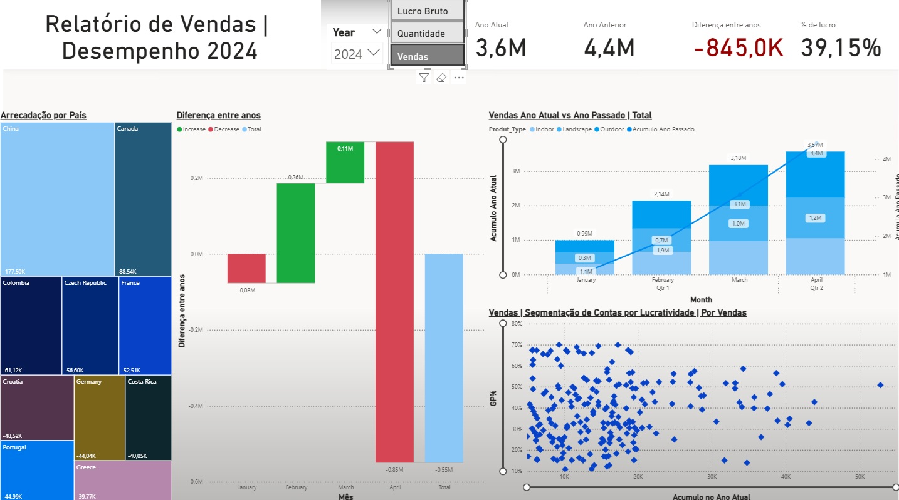
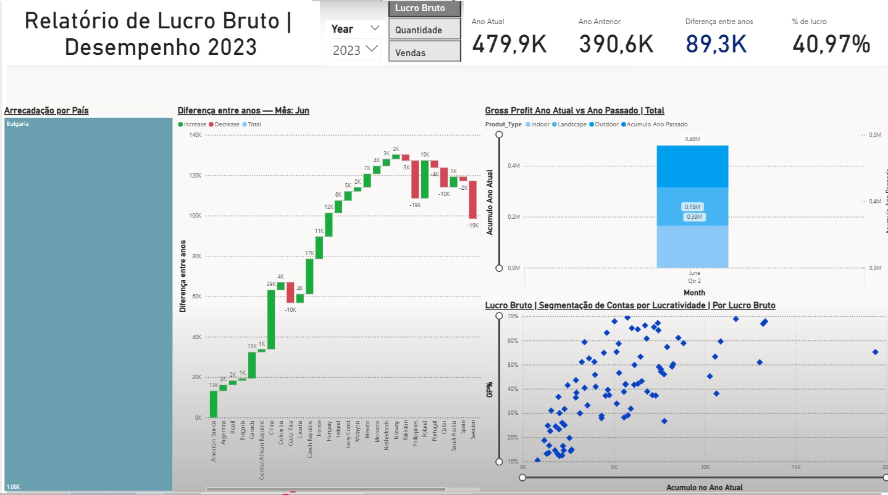
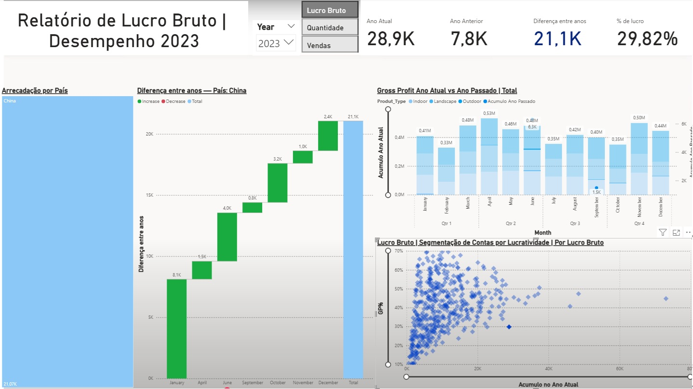

# 📊 Análise de Vendas e Lucro — Dashboard Interativo Power BI

## 📝 Sobre o Projeto
Este é um projeto de portfolio feito para monitorar os KPI de uma empresa fictícia internacional de plantas e criar um dashboard interativo no Power BI para acompanhar métricas de vendas, quantidades, lucros e desempenho global. Os dados estão no arquivo excel.

Todas as medidas foram feitas em DAX no objetivo de desenvolver as minhas habilidades com a ferramenta.

O painel oferece uma visão gerencial dos KPI's e contem dois filtros que afetam todo o dashboard, é possivel filtrar por Ano e por tipo de indicador ( Lucro, Faturamento bruto  e Quantidade), todos os titulos são atualizados de acordo com o que esta sendo visualizado e os visuais são interativos

## **Visão Geral do Dashboard**

O dashboard contém os seguintes visuais principais:

- **Treemap – Arrecadação por País:** identifica rapidamente os países com maior e menor participação na receita.
- **Gráfico Waterfall – Variação Mês a Mês:** mostra se houve aumento ou redução no KPI selecionado (**Vendas, Quantidade ou Lucro Bruto**).  
- **Gráfico de Colunas + Linha – Comparativo Ano a Ano:** compara a evolução mensal do KPI escolhido com o acumulado do ano anterior.
- **Scatterplot – Lucratividade por Conta:** apresenta a relação entre **margem de lucro (%)** e **acúmulo no ano** para cada conta de cliente.
- **Cards de KPIs:** destacam os principais indicadores — valores do ano atual, ano anterior, diferença absoluta e percentual de lucro.
- **Slicer Dinâmico:** permite alternar entre os KPIs de forma simples.

---

## **Drill Down no Gráfico Waterfall**

O gráfico waterfall permite realizar **drill down** para analisar os resultados com mais profundidade.  
A hierarquia de detalhamento segue a seguinte ordem:

**Mês → Tipo de Produto → Produto**

No exemplo abaixo, foi realizado o drill down em um mês específico, detalhando os resultados por **tipo de produto**. Essa funcionalidade permite investigar rapidamente quais categorias mais impactaram o desempenho mensal.

---

## **Segmentação de Contas no Scatterplot**

O scatterplot exibe a **lucratividade (%)** de cada conta em relação ao **valor acumulado no ano**.  
É possível selecionar uma **conta específica** diretamente no gráfico, filtrando todos os demais visuais para acompanhar os indicadores relacionados a esse cliente individualmente.

No exemplo abaixo, foi selecionada **uma única conta**, permitindo analisar sua performance detalhada.

## 🛠️ Ferramentas e Tecnologias
| Ferramenta | Finalidade |
|-----------|------------|
| **Power BI** | Criação do dashboard, visualizações e KPIs |
| **DAX** | Todas as medidas na tabela 'measures' foram criadas utilizando DAX |
| **Power Query** | Foi utilizado para tratar os dados antes de montas os visuais |
| **Excel / CSV** | Base de dados para análise |
| **GitHub** | Versionamento e publicação do projeto |

---

## 📊 Principais Métricas (KPIs)
- **Vendas Totais**: valores acumulados e comparativos.
- **Quantidade Vendida**: evolução mensal e por produto.
- **Lucro Bruto**: análise do impacto financeiro.
- **Diferença entre anos (%)**: crescimento ou queda ano a ano.
- **Distribuição por País**: mapa e ranking de performance.

---

## 🖼️ Visualizações do Dashboard

### Plant_FACT *(2.440 linhas × 7 colunas)*  
Tabela de **fatos de vendas**, representando cada transação.

| Coluna         | Descrição                                      |
|---------------|-----------------------------------------------|
| Product_id    | Identificador único do produto vendido         |
| Sales_USD     | Valor da venda em dólares                      |
| quantity      | Quantidade vendida                             |
| Price_USD     | Preço unitário do produto em dólares           |
| COGS_USD      | Custo do produto vendido (Cost of Goods Sold)  |
| Date_Time     | Data e hora da transação                       |
| Account_id    | Chave para identificar o cliente na tabela **Accounts** |

Essa é a tabela fato

### Accounts *(1.744 linhas × 10 colunas)*  
Tabela de **clientes** ( tabela dimensão), contendo informações globais sobre localização e identificação.

| Coluna         | Descrição                               |
|---------------|----------------------------------------|
| Account_id    | Identificador único do cliente          |
| Account       | Nome da conta ou cliente                |
| country_code  | Código do país (ISO)                    |
| country2      | Nome do país                            |
| latitude2     | Latitude da localização                 |
| longitude     | Longitude da localização                |
| Postal_code   | Código postal                           |
| street_name   | Nome da rua                             |
| Street_number | Número do endereço                      |

### Plant_Hierarchy *(1.000 linhas × 8 colunas)*  
Tabela de **dimensão de produtos** (tabela dimensão), com detalhes sobre famílias, grupos e características.

| Coluna          | Descrição                            |
|-----------------|-------------------------------------|
| Product_Family  | Família principal do produto         |
| Product_Group   | Subcategoria dentro da família       |
| Product_Name    | Nome do produto                      |
| Product_Size    | Tamanho do produto                   |
| Produt_Type     | Tipo do produto                      |

---
